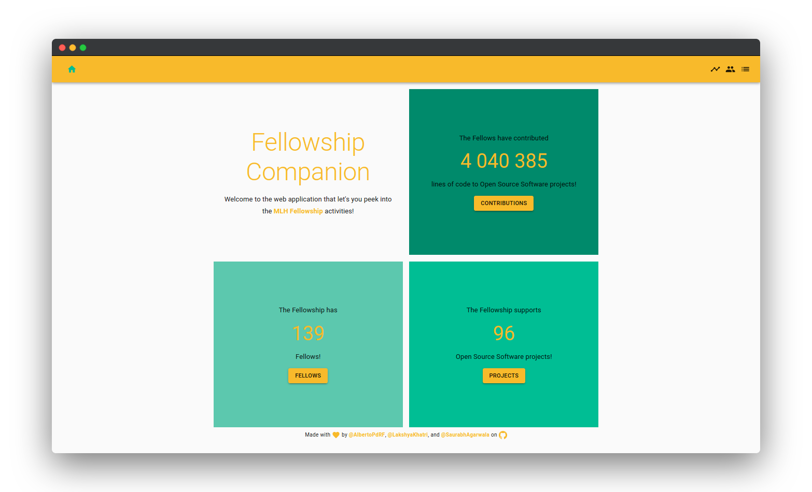

# Fellowship-Companion



<p align="center">
 <a href="https://deploy-preview-90--fellowship-companion.netlify.app/"><b>Live Demo</b></a>
</p>

## Description

Fellowship Companion is a web app that will help you peek into MLH Fellowship activities. This will contain day-to-day activities of fellows.

## Inspiration

While working on open-source projects in MLH Fellowship we saw people being curious about their progress, their contributions and also about the progress that other fellows are making. So, we came up with an idea of making a web app that can track every single step of MLH Fellowship and let everyone see whats going on inside the Fellowship.

## Features

Fellowship Companion offers following features (everything can be filtered by individual Fellow, Repository, Team, or overall MLH Fellowship Organization):

- Total Lines of Code (LOC) contributed
- Number of PRs opened
- Number of PRs merged
- Number of Issues Opened
- Number of Issues Resolved
- Activity of Issues, PRS, forks (for repositories forked under MLH organization)

## Technologies Used

- Backend
  - Django
  - Django Rest Framework
  - GitHub API
- Frontend
  - React
  - Material-UI
- Deployment
  - Nginx
  - Gunicorn
  - Google Cloud Platform
  - Python Anywhere
  - Netlify

## Live Demo

- [The App](https://deploy-preview-90--fellowship-companion.netlify.app/)
- [API Endpoints](https://agsaurabh.pythonanywhere.com/api/v1/overview/) (API Docs coming soon) <!-- @TODO: Add the Docs -->

## Local Setup

1. Clone the project
2. Change directory to the root of the project

### Backend Setup

1. Create a [Python Virtual Environment](https://www.geeksforgeeks.org/python-virtual-environment/#:~:text=A%20virtual%20environment%20is%20a,of%20the%20Python%20developers%20use.) and activate it

2. Move to the [`server`](server) directory and install the dependencies using the command

   ```bash
   pip install -r requirements.txt
   ```

3. Move to the [`src`](server/src) directory and execute the following commands to setup and run the project

   ```bash
   python3 manage.py makemigrations
   python3 manage.py migrate
   python3 manage.py collectstatic
   python3 manage.py runserver
   ```

4. Visit [`localhost:8000`](http://localhost:8000) to see the deployed backend

### Frontend Setup

1. Setup [Yarn](https://yarnpkg.com/)

2. Move to the [`client`](client) directory and execute the following commands to setup and start the client side app

   ```bash
   yarn install
   yarn start
   ```

3. Visit [`localhost:3000`](http://localhost:3000) to see the deployed backend

> Note: For the client to display the response of the backend endpoints, the `API endpoint` needs to be updaed in the client side code according to where it is running

## Future Scope

We will be mainly focusing on adding more features to this project, but the main focus will be on these things:

- Made data to be updated on hourly basis (or faster if possible).
- Issue Suggestions
- UI for top contributors
- Map for showing country-wise contributions
- UI for Popular Languages and Repositories
- UI improvements

## Authors

|  |  |  |
| ---------------------------------------------------------------------------------------------------------- | ------------------------------------------------------------------------------------------------ | ---------------------------------------------------------------------------------------------------- |
| [Alberto Pérez de Rada Fiol](https://github.com/AlbertoPdRF)                                               | [Lakshya Khatri ](https://github.com/LakshyaKhatri)                                              | [Saurabh Agarwala](https://github.com/SaurabhAgarwala)                                               |

## License

This project (Fellowship Companion) is licensed under [MIT License](LICENSE)
